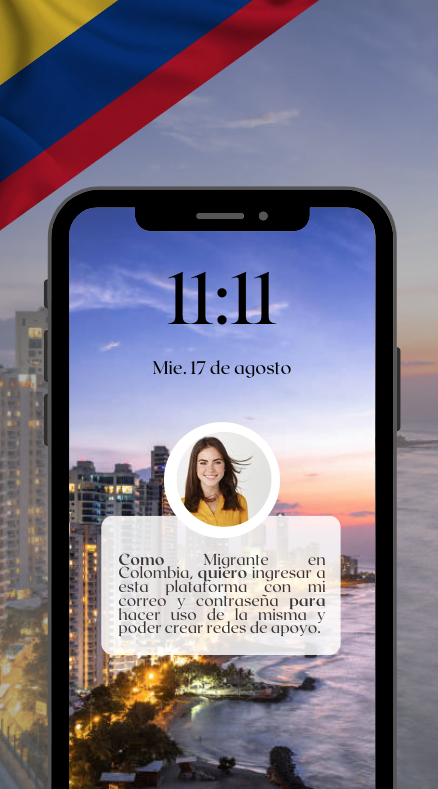
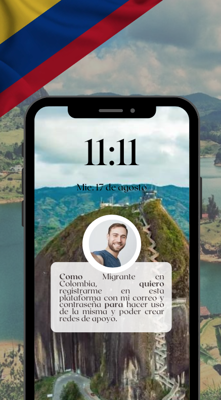
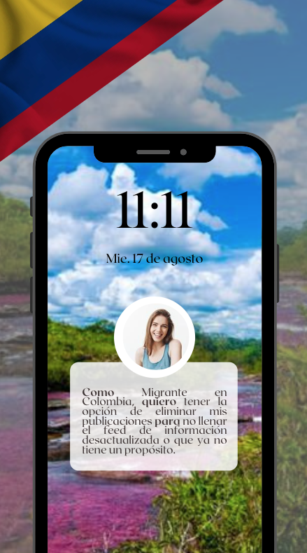
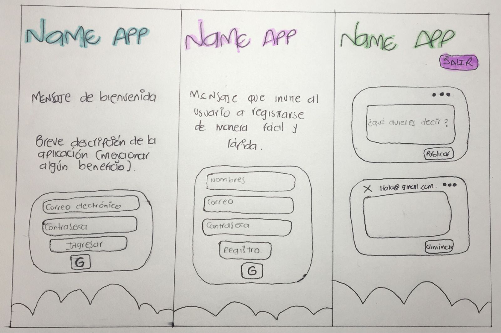
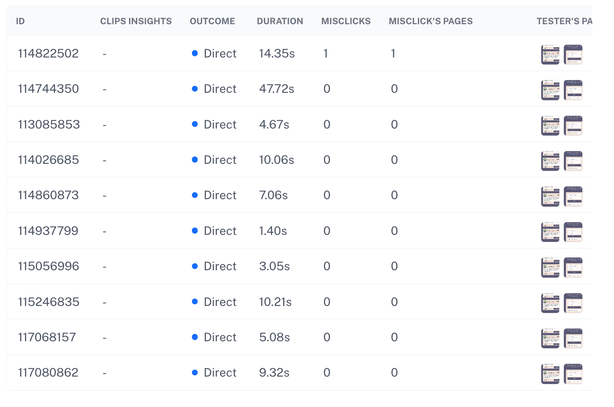
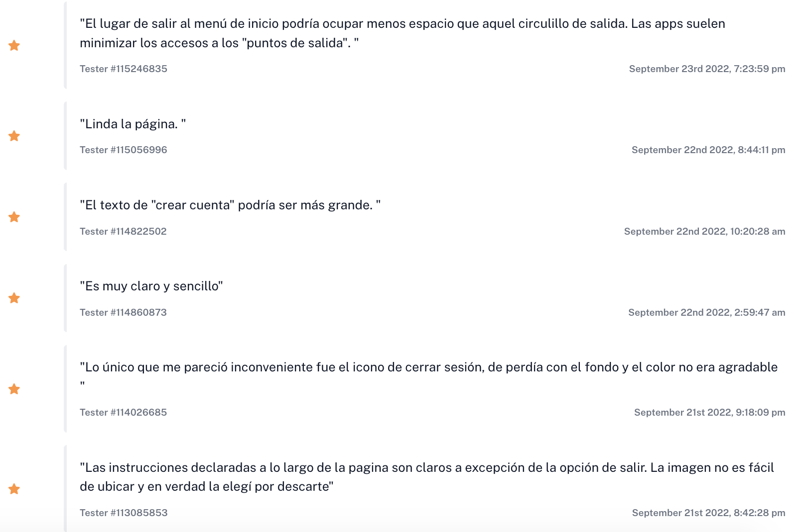

# Social Network - MigroRed 🌎

## Índice

* [1. Definición del producto](#1-preámbulo)
* [2. Principales usuarios](#2-resumen-del-proyecto)
* [3. Historias de usuario](#3-objetivos-de-aprendizaje)
* [4. Diseño de la interfaz: Prototipos](#4-consideraciones-generales)
* [5. Producto final - Interfaz de usuario](#5-criterios-de-aceptación-mínimos-del-proyecto)

## 1. Definición del producto

Un proceso migratorio implica retos enormes de adaptación para las personas, además de tener que ajustarse a las dinámicas del nuevo contexto, es indispensable para ellas crear redes de apoyo nuevas y, en la actualidad, las redes sociales juegan un papel fundamental en este proceso.

> Según Benítez, J. L. (2011), las redes sociales tienen “un papel decisivo en los procesos de toma de decisión de emigrar, el viaje o tránsito, la llegada e inserción en los países de destino, el mantenimiento de lazos y los procesos de comunicación transnacional” (Benítez, 2011, p. 39). 

*Benítez, J. L. (2011). La comunicación transnacional de las familias e-migrantes. San Salvador: pnud/uca.*

Establecer nuevas redes de apoyo contribuye al proceso de adaptación y, para muchas personas, resulta difícil crear estos primeros contactos. Las redes sociales que existen actualmente para conocer personas nuevas están creadas para múltiples finalidades como, por ejemplo, construir lazos románticos. Este tipo de funciones no se alinean directamente con los deseos de nuestrxs usuarixs objetivo, por esto ideamos una aplicación exclusivamente para personas migrantes que deseen conocer a otras.

De esta manera, MigroRed al ser exclusivamente para migrantes que deseen ampliar su red, puede facilitar el establecimiento exitoso de los vínculos que nuestrxs usuarixs buscan.

## 2. Principales usuarios

Inicialmente, MigroRed está dirigida a personas migrantes que hayan llegado a Colombia y deseen ampliar su red de apoyo conociendo personas con los mismos intereses. A futuro, queremos que MigroRed sea una aplicación global con más funcionalidades que faciliten el objetivo de sus usuarixs.

______________________________________________________________________________________________________________________________________________

## 3. Historias de usuario.

A continuación, las historias de usuario en las que enfocamos toda la funcionalidad de nuestra aplicación, así mismo, nos aseguramos de que tuvieran un criterio mínimo de aceptación y una clara definición de terminado.

*Historia de Usuario #1:*

***Criterio de aceptación:*** El Usuario debe poder ingresar a la plataforma con su correo electrónico y contraseña y poder empezar a hacer uso de la app.
***Definición de terminado:*** La interfaz permite acceder a la plataforma haciendo una verificación de que el correo ingresado en el campo de e-mail ya se ecuentre registrado en la misma, a continuación en caso de que si se encuentre registrado posterior a hacer click sobre el botón de ingreso, el usuario podría ver el muro e interactuar, sin embargo, en caso contrario, la app arrojará un error que invita al usuario a hacer click sobre el link de "Registrate aquí" y proceder con el debido registro.

*Historia de Usuario #2:*

***Criterio de aceptación:*** El Usuario debe poder registrarse en la plataforma con su correo electrónico y contraseña y poder empezar a hacer uso de la app.
***Definición de terminado:*** La interfaz permite registrarse en la plataforma haciendo una verificación de que el correo ingresado en el campo de e-mail no se ecuentre registrado en la misma, a continuación en caso de que no se encuentre registrado posterior a hacer click sobre el botón de registro, el usuario podrá registrarse de manera existosa, ver el muro e interactuar, sin embargo, en caso contrario, la app arrojará un error que invita al usuario a hacer click sobre el link de "Si tienes una cuenta inicia sesión aquí" y proceder con el debido inicio de sesión.

*Historia de Usuario #3:*

***Criterio de aceptación:*** El Usuario debe poder registrarse en la plataforma con su cuenta de Google y poder empezar a hacer uso de la app.
***Definición de terminado:*** La interfaz permite registrarse en la plataforma por medio del proveedor Google, a continuación, el usuario podrá registrarse de manera existosa, ver el muro e interactuar.

*Historia de Usuario #4:*

***Criterio de aceptación:*** El Usuario debe poder empezar a crear sus primeras publicaciones en la aplicación.
***Definición de terminado:*** La interfaz permite una vez el usuario se encuentre en el muro ver el textArea destinado para iniciar la pulicación, escribir su comunicación y posteriormente hacer click en el botón "Publicar".

*Historia de Usuario #5:*

***Criterio de aceptación:*** El Usuario debe poder editar sus propias publicaciones en la aplicación.
***Definición de terminado:*** La interfaz permite una vez el usuario postee algún contenido, tenga la posibilidad de evidenciar el botón de editar y poder modificar su publicación.

*Historia de Usuario #6:*

***Criterio de aceptación:*** El Usuario debe poder eliminar sus propias publicaciones en la aplicación.
***Definición de temrinado:*** La interfaz permite una vez el usuario postee algún contenido, tenga la posibilidad de evidenciar el botón de eliminar y poder borrar su publicación.

*Historia de Usuario #7:*

***Criterio de aceptación:*** El Usuario debe poder dar like que no es más qu su agrado con la publicación de otros miembros de la aplicación.
***Definición de terminado:*** La interfaz permite al usuario la posibilidad de evidenciar el botón de "Like" y poder mostrar su agrado o apoyo a las publicaciones de otros miembros de la red.

*Historia de Usuario #8:*

***Criterio de aceptación:*** El Usuario debe poder salir o cerrar sesión de la aplicación.
***Definición de terminado:*** La interfaz permite al usuario la posibilidad de evidenciar el botón "Salir" y poder volver a la vista de Login y así manetener su cuenta segura.

______________________________________________________________________________________________________________________________________________

## 4. Diseño de la interfaz: Prototipos

***Flujo que seguirá el usuario:*** El Usuario de MigroRed iniciará su recorrido por la página de Ingreso, la cual invitará a que el mismo ingrese su correo electrónico y contraseña previamente registrado, en caso contrario invitará al mismo a registrarse, paso seguido, el usuario podrá ver las publicaciones que otros usuarios han hecho, así mismo, podrá interactuar con las mismas por medio de Likes, de igual manera, podrá hacer sus propias publicaciones, editarlas y eliminarlas si es lo que desea, por último, podrá cerrar su sesión de miembro de MigroRed e inicar de nuevo en nuestra vista de inicio:

***PROTOTIPO DE BAJA FIDELIDAD***

Este fue nuestro primer prototipo de baja fidelidad, en este punto el equipo no tenía claro el tema al que queríamos apuntar la aplicación, sin embargo, comenzamos haciendo un maquetado a lápiz que nos permitiera ponernos en contexto de lo que queríamos:

En este punto, ya teníamos un poco más claro que lo que queríamos hacer era una aplicación enfocada en los migrantes alrededor del mundo, sin embargo, el nombre no era algo que tuviesemos claro, pero, comenzamos a iterar nuestro prototipo con ayuda de una herramienta tecnológica:

***PROTOTIPO DE ALTA FIDELIDAD - FIGMA***

En nuestro prototipo de alta ya teníamos claro el nombre de nuestra app y aquellos detalles que la misma requería, este es el modelo más cercano a nuestra aplicación final, a continuación, todas las vistas:

______________________________________________________________________________________________________________________________________________

***TEST DE USABILIDAD***

MigroRed es una aplicación user-centricity, desde el inicio para nosotras como creadoras, el usuario fue lo primero y fundamental de nuestra aplicación, es por eso que nos enfocamos en hacer una serie de test de usabilidad para conocer la opinión de los usuarios que interactuaban con nustra aplicación, para tal fin, hicimos uso de Maze.co una herramienta muy útil que nos permite ver la opinión exacta y comentarios del usuario como su participacióln en tiempo real, así mismo, podemos evidenciar clicks perdidos y el tiempo que tomó al usuario cumplir cada misión asignada, ahora bien, al tener mencionados resultados iteramos sobre nuestro prototipo entregando una aplicación agradable y con propósito para nuestros usuarios, los resultados de este test fueron los siguiente:

*Usuarios Testeados*

En este test tomamos la opinión de 15 usuarios que interactuaron con nuestra aplicación:

*La misión de iniciar sesión y registrarse en MigroRed:*

Respuesta del usuario: Como podemos ver en la imágen de las estadísticas, hubo usuarios que tuvieron "clicks" equivocados.

*Problema encontrado:* Usuarios con clicks en lugares no solicitados, es posible que se esté generando alguna confusión con los botones implementados.
*Análisis:* Al revisar el heatmap que nos permite ver el lugar en el que el usuario  interactuó con su cursor pudimos darnos cuenta que el usuario creyó debía poner primero su correo y contraseña para posteriormente hacer click e el botón de iniciar sesión y registrarse que era la misión final.
*Solución:* El enunciado de la misión era claro en el sentido de que indicaba que debía el usuario hacer de cuenta que el correo y la contraseña ya estaban suministradas, por ende, consideramos nuestro prototipo no tenía lugar a iteración en este sentido.

*La misión de volver al inicio de sesión:*

Respuesta del usuario: Como podemos ver en la imágen de las estadísticas, los usuarios en este caso no presentaron "clicks" perdidos.

*Análisis:* En est sentido no vemos la necesidad de iterar nuestro prototipo en cuanto al link que invita al usuario a volver a la página de inicio de sesión:

*La misión de cerrar sesión:*

Respuesta del usuario: Como podemos ver en la imágen de las estadísticas, los usuarios en este caso no presentaron "clicks" perdidos, sin embargo, en la pregunta abierta de comentarios si manifestaron comentarios sobre el botón de salir.
*Problema encontrado:* Usuarios encuentran de dificil visibilidad el botón de cerrar sesión.
*Análisis:* Al revisar la pregunta abierta (que fue una herramienta fundamental para entender al usuario) evidenciamos que para el mismo resultaba difícil encontrar el botón de salida, así mismo, algunos manifestaron que el mismo estaba ubicado en un lugar inesperado.
*Solución:* Utilizamos herramientas como https://material.io/, herramienta que nos dejó ver el motivo de estas respuesta, el mismo fue que estábamos usando color negro sobre nuestro background que es morado, por ende, esa combinación de colores no era adecuada y efectivamente dificultaba la visibilidad, por tal motivo, decidimos no usar un icono para salir, en vez de eso utilizamos un boton con un texto claro de salida y en un color violeta con letra blanca que es el indicado para el tipo de background que manejamos.

*Al pregunta a los usuarios que tan amigable consideraba el diseño de MigroRed, sus respuestas fueron las siguientes*

## 5. Producto final - Interfaz de usuario

Desde el inicio MigroRed se enfocó en tener al usuario como base para esta aplicación, es por eso que gracias a Test de usabilidad, feedback de nuestros Coaches y Compañeras pudimos lograr un diseño eficiente, con propósito y que se adapta a las necesidades de nuestros usuarios, a continuación nuestra aplicación en su diseño final en prototipo movil:

*Los íconos de Like y editar los atribuimos al trabajo de los diseñadores de https://www.freepik.com/*